# Functioneel Ontwerp

Groep Zero

80 uur (per persoon) te verdelen
Inschatting verdeeld door: 

* Tim: 80

* Jelle: 80

* Damian: 80

* Kevin: 80

* Ewout: 80

# Student

Als Student kan ik inloggen zodat ik gebruik kan maken van de applicatie om vakken op te zoeken. 

Als Student kan ik uitloggen zodat mijn sessie wordt afgesloten.

Als Student kan ik vakken opzoeken zodat ik informatie kan vinden over een vak. 40 uur

Als Student kan ik zoekopdrachten filteren zodat ik gemakkelijk en snel precies kan zoeken. 40 uur

Als Student kan ik de gegevens van het vervangende vak inzien zodat ik deze informatie kan gebruiken voor het inschrijven. 40 uur

Als Student kan ik vakken bekijken zodat ik het overzicht kan houden.

# Onderwijscommissie

Als onderwijscommissie kan ik inloggen zodat ik gebruik kan maken van de applicatie om vakken op te zoeken. 

Als onderwijscommissie kan ik een excel template importeren om zo de gegevens in het systeem te zetten. 40 uur

Als onderwijscommissie kan ik exporteren naar excel om informatie vanuit het systeem makkelijk in kan lezen. 40 uur

Als onderwijscommissie kan ik een opmerking bij een vak achterlaten om zo extra informatie door te kunnen geven aan andere bevoegde leden.40 uur

Als onderwijscommissie kan ik een nieuw bezem vak voorstellen zodat de examencommissie dit goed kan keuren zodra zij het er mee eens zijn. 40 uur

Als onderwijscommissie kan ik vakken bekijken zodat ik het overzicht kan houden.

# Examencommissie

Als examencommissie kan ik inloggen zodat ik gebruik kan maken van de applicatie om vakken op te zoeken. 

Als examencommissie kan ik een bezem vak aanpassen zodat wanneer er een bezem vak wordt aangepast, dit zichtbaar is online. 40 uur

Als examencommissie kan ik een bezem vak archiveren zodat er zodra er een bezem vak niet meer gedoceerd wordt, deze geen verwarring kan brengen onder studenten en docenten. 40 uur

Als examencommissie kan ik een voorstel beoordelen zodat degenen die dit voorstel hebben toegestuurd daar online antwoord op krijgen. 40 uur

Als examencommissie kan ik vakken bekijken zodat ik het overzicht kan houden.

Als examencommissie kan ik exporteren naar excel om informatie vanuit het systeem makkelijk in kan lezen. 

# Onderwijscoördinator

Als onderwijscoördinator  kan ik inloggen zodat ik gebruik kan maken van de applicatie om vakken op te zoeken. 

Als onderwijscoördinator kan ik een excel template importeren om zo de gegevens in het systeem te zetten. 

Als onderwijscoördinator kan ik exporteren naar excel om informatie vanuit het systeem makkelijk in kan lezen. 

Als onderwijscoördinator kan ik vakken bekijken zodat ik het overzicht kan houden.

Als Admin  kan ik inloggen zodat ik gebruik kan maken van de applicatie om vakken op te zoeken. 

# Admin

Als Admin kan ik accounts aanmaken zodat mensen dit kunnen gebruiken

Als Admin kan ik een rol geven aan een account zodat het account rechten heeft:

Als Admin kan ik vakken bekijken zodat ik het overzicht kan houden.

Use cases, klassen en toestandsdiagrammen

#  Tim

___________________________________________________________________________

## Use case

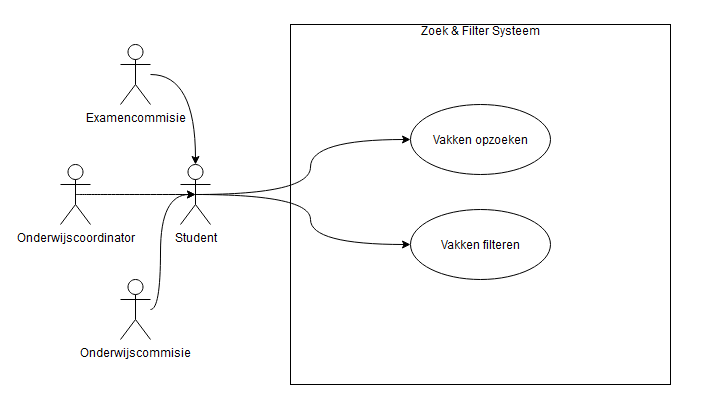

## Use case templates

<table>
  <tr>
    <td>UC-01</td>
    <td>Beschrijving</td>
  </tr>
  <tr>
    <td>Naam</td>
    <td>Vakken opzoeken</td>
  </tr>
  <tr>
    <td>Beschrijving</td>
    <td>Actor kan vakken filteren door middel van een zoekbalk</td>
  </tr>
  <tr>
    <td>Actors</td>
    <td>Student, Onderwijscoördinator, Examencommissie, Onderwijscommissie</td>
  </tr>
  <tr>
    <td>Preconditie</td>
    <td>Actor moet ingelogd zijn</td>
  </tr>
  <tr>
    <td>Scenario</td>
    <td>Het systeem start op
         
        Actor klikt op de zoekbalk
         
        Actor voert zoekterm(en) in
         
        Systeem sluit af</td>
  </tr>
  <tr>
    <td>Postconditie</td>
    <td>Systeem laat een tabel zien met daarin de juiste gegevens gebaseerd op de zoekterm(en)</td>
  </tr>
  <tr>
    <td>Alternatief Scenario</td>
    <td>n.v.t</td>
  </tr>
  <tr>
    <td>Exception scenario</td>
    <td>UC-E-01</td>
  </tr>
  <tr>
    <td>Trigger</td>
    <td>Actor heeft een zoekterm ingevoerd die geen resultaten geeft</td>
  </tr>
  <tr>
    <td>Scenario</td>
    <td>Systeem start op
      Actor klikt op de zoekbalk
       
      Actor voert zoekterm(en) in
       
      Systeem geeft foutmelding dat er niet is om te laten zien
       
      Systeem stuurt actor terug naar stap 2
    </td>
  </tr>
  <tr>
    <td>E-Postconditie</td>
    <td>n.v.t</td>
  </tr>
</table>

<table>
  <tr>
    <td>UC-02</td>
    <td>Beschrijving</td>
  </tr>
  <tr>
    <td>Naam</td>
    <td>Vakken filteren</td>
  </tr>
  <tr>
    <td>Beschrijving</td>
    <td>Actor kan vakken filteren door middel van een dropdown</td>
  </tr>
  <tr>
    <td>Actors</td>
    <td>Student, Onderwijscoördinator, Examencommissie, Onderwijscommissie</td>
  </tr>
  <tr>
    <td>Preconditie</td>
    <td>Actor moet ingelogd zijn</td>
  </tr>
  <tr>
    <td>Scenario</td>
    <td>Het systeem start op
      Actor klikt op de filter knop
       
      Systeem toont verschillende opties
       
      Actor kiest een van de gegeven opties
       
      Systeem sluit af
    </td>
  </tr>
  <tr>
    <td>Postconditie</td>
    <td>Systeem laat een tabel zien met daarin de juiste gegevens gebaseerd op het filter</td>
  </tr>
  <tr>
    <td>Alternatief Scenario</td>
    <td>n.v.t</td>
  </tr>
  <tr>
    <td>Exception scenario</td>
    <td>n.v.t</td>
  </tr>
</table>

## Toestandsdiagrammen

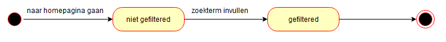

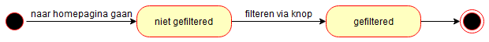

## Klassendiagram

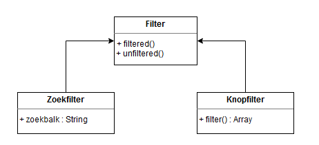

___________________________________________________________________________

# Jelle

___________________________________________________________________________

## Klassendiagram

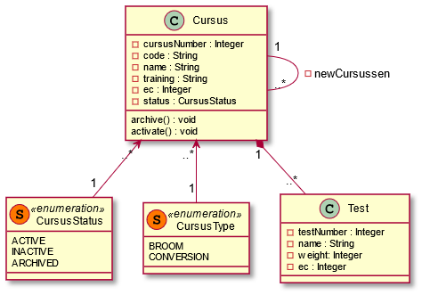

## **Bezem vak archiveren**

*"Als examencommissie kan ik een bezem vak archiveren zodat er zodra er een bezem vak niet meer gedoceerd wordt, deze geen verwarring kan brengen onder studenten en docenten."*

### Use case diagram

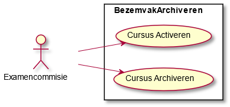

### Use case templates

  <table class="c10">
    <tbody>
        <tr class="c3">
            <td class="c35" colspan="1" rowspan="1">
                
UC-01

            </td>
            <td class="c41" colspan="1" rowspan="1">
                
&nbsp;

            </td>
        </tr>
        <tr class="c3">
            <td class="c35" colspan="1" rowspan="1">
                
Naam

            </td>
            <td class="c41" colspan="1" rowspan="1">
                
Cursus archiveren

            </td>
        </tr>
        <tr class="c3">
            <td class="c35" colspan="1" rowspan="1">
                
Beschrijving

            </td>
            <td class="c41" colspan="1" rowspan="1">
                
Actor kan een cursus archiveren.

            </td>
        </tr>
        <tr class="c3">
            <td class="c35" colspan="1" rowspan="1">
                
Actors

            </td>
            <td class="c41" colspan="1" rowspan="1">
                
Examencommissie

            </td>
        </tr>
        <tr class="c38">
            <td class="c35" colspan="1" rowspan="1">
                
Main scenario

            </td>
            <td class="c41" colspan="1" rowspan="1">
                

                <table class="c10">
                    <tbody>
                        <tr class="c3">
                            <td class="c33" colspan="1" rowspan="1">
                                
Pre conditie

                            </td>
                            <td class="c50" colspan="1" rowspan="1">
                                
Cursus moet zijn geactiveerd.

                            </td>
                        </tr>
                        <tr class="c60">
                            <td class="c33" colspan="1" rowspan="1">
                                
Scenario

                            </td>
                            <td class="c50" colspan="1" rowspan="1">
                                
1. &nbsp; &nbsp; &nbsp;Systeem toont
                                        cursus.

                                
2. &nbsp; &nbsp; &nbsp;Als Actor is
                                        geautoriseerd.

                                
2.1. &nbsp; Systeem toont
                                        &ldquo;archiveren&rdquo; knop

                                
2.2. &nbsp; Actor drukt op
                                        &ldquo;archiveren&rdquo; knop

                                
2.3. &nbsp; Systeem archiveert cursus.

                                
3. &nbsp; &nbsp; &nbsp;Usecase eindigt.
                                

                            </td>
                        </tr>
                        <tr class="c3">
                            <td class="c33" colspan="1" rowspan="1">
                                
Postconditie

                            </td>
                            <td class="c50" colspan="1" rowspan="1">
                                
Cursus is gearchiveerd.

                            </td>
                        </tr>
                    </tbody>
                </table>
                

            </td>
        </tr>
        <tr class="c73">
            <td class="c35" colspan="1" rowspan="1">
                
Alternatief scenario

            </td>
            <td class="c41" colspan="1" rowspan="1">
                

                <table class="c10">
                    <tbody>
                        <tr class="c3">
                            <td class="c24" colspan="1" rowspan="1">
                                
ID

                            </td>
                            <td class="c13" colspan="1" rowspan="1">
                                
Niet geautoriseerd

                            </td>
                        </tr>
                        <tr class="c3">
                            <td class="c24" colspan="1" rowspan="1">
                                
Trigger

                            </td>
                            <td class="c13" colspan="1" rowspan="1">
                                
Actor is in stap 2 niet geautoriseerd

                            </td>
                        </tr>
                        <tr class="c47">
                            <td class="c24" colspan="1" rowspan="1">
                                
Scenario

                            </td>
                            <td class="c13" colspan="1" rowspan="1">
                                
1. Systeem toont cursus

                                
2. Usecase eindigt

                            </td>
                        </tr>
                        <tr class="c3">
                            <td class="c24" colspan="1" rowspan="1">
                                
Postconditie

                            </td>
                            <td class="c13" colspan="1" rowspan="1">
                                
n.v.t.

                            </td>
                        </tr>
                    </tbody>
                </table>
                

            </td>
        </tr>
        <tr class="c69">
            <td class="c35" colspan="1" rowspan="1">
                
Exception scenario

            </td>
            <td class="c41" colspan="1" rowspan="1">
                
n.v.t.

            </td>
        </tr>
    </tbody>
</table>

<table class="c10">
    <tbody>
        <tr class="c3">
            <td class="c35" colspan="1" rowspan="1">
                
UC-02

            </td>
            <td class="c41" colspan="1" rowspan="1">
                
&nbsp;

            </td>
        </tr>
        <tr class="c3">
            <td class="c35" colspan="1" rowspan="1">
                
Naam

            </td>
            <td class="c41" colspan="1" rowspan="1">
                
Cursus activeren

            </td>
        </tr>
        <tr class="c3">
            <td class="c35" colspan="1" rowspan="1">
                
Beschrijving

            </td>
            <td class="c41" colspan="1" rowspan="1">
                
Actor kan een cursus activeren.

            </td>
        </tr>
        <tr class="c3">
            <td class="c35" colspan="1" rowspan="1">
                
Actors

            </td>
            <td class="c41" colspan="1" rowspan="1">
                
Examencommissie

            </td>
        </tr>
        <tr class="c38">
            <td class="c35" colspan="1" rowspan="1">
                
Main scenario

            </td>
            <td class="c41" colspan="1" rowspan="1">
                

                <table class="c10">
                    <tbody>
                        <tr class="c3">
                            <td class="c26" colspan="1" rowspan="1">
                                
Pre conditie

                            </td>
                            <td class="c63" colspan="1" rowspan="1">
                                
Actor is geautoriseerd

                            </td>
                        </tr>
                        <tr class="c60">
                            <td class="c26" colspan="1" rowspan="1">
                                
Scenario

                            </td>
                            <td class="c63" colspan="1" rowspan="1">
                                
1. &nbsp; &nbsp; &nbsp;Systeem toont lijst met
                                        cursussen

                                
2. &nbsp; &nbsp; &nbsp;Actor selecteert cursussen
                                        die geactiveerd moeten worden.

                                
3. &nbsp; &nbsp; &nbsp;Actor drukt na selectie op
                                        &ldquo;Activeren&rdquo; knop.

                                
4. &nbsp; &nbsp; &nbsp;Systeem activeert
                                        geselecteerde cursussen.

                                
5. &nbsp; &nbsp; &nbsp;Usecase eindigt

                            </td>
                        </tr>
                        <tr class="c3">
                            <td class="c26" colspan="1" rowspan="1">
                                
Postconditie

                            </td>
                            <td class="c63" colspan="1" rowspan="1">
                                
Cursussen zijn geactiveerd.

                            </td>
                        </tr>
                    </tbody>
                </table>
                

            </td>
        </tr>
        <tr class="c22">
            <td class="c35" colspan="1" rowspan="1">
                
Alternatief scenario

            </td>
            <td class="c41" colspan="1" rowspan="1">
                

                <table class="c10">
                    <tbody>
                        <tr class="c3">
                            <td class="c24" colspan="1" rowspan="1">
                                
ID

                            </td>
                            <td class="c13" colspan="1" rowspan="1">
                                
Niet geautoriseerd

                            </td>
                        </tr>
                        <tr class="c3">
                            <td class="c24" colspan="1" rowspan="1">
                                
Trigger

                            </td>
                            <td class="c13" colspan="1" rowspan="1">
                                
Actor is in preconditie niet geautoriseerd

                            </td>
                        </tr>
                        <tr class="c56">
                            <td class="c24" colspan="1" rowspan="1">
                                
Scenario

                            </td>
                            <td class="c13" colspan="1" rowspan="1">
                                
1. Systeem laadt in plaats van pagina een 405 error
                                        zien.

                                
2. Usecase eindigt.

                            </td>
                        </tr>
                        <tr class="c3">
                            <td class="c24" colspan="1" rowspan="1">
                                
Postconditie

                            </td>
                            <td class="c13" colspan="1" rowspan="1">
                                
n.v.t.

                            </td>
                        </tr>
                    </tbody>
                </table>
                

            </td>
        </tr>
        <tr class="c62">
            <td class="c35" colspan="1" rowspan="1">
                
Exception scenario

            </td>
            <td class="c41" colspan="1" rowspan="1">
                
n.v.t.

            </td>
        </tr>
    </tbody>
</table>
 

### Toestandsdiagram

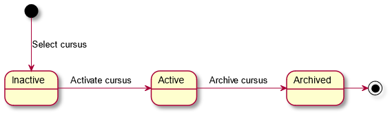

## **Gegevens vervangend vak inzien**

*"Als gebruiker kan ik de gegevens van het vervangende vak inzien zodat ik deze informatie kan gebruiken voor het inschrijven."*

*Zelfde klassendiagram gebruikt als Bezem vak archiveren.*

### Use case diagram

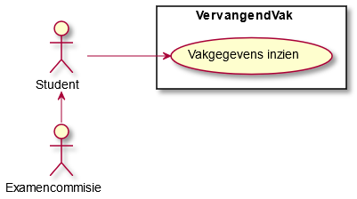

### Use case template(s)

<table class="c10">
    <tbody>
        <tr class="c3">
            <td class="c49" colspan="1" rowspan="1">
                
UC-04

            </td>
            <td class="c36" colspan="1" rowspan="1">
                
&nbsp;

            </td>
        </tr>
        <tr class="c3">
            <td class="c49" colspan="1" rowspan="1">
                
Naam

            </td>
            <td class="c36" colspan="1" rowspan="1">
                
Gegevens vervangend vak inzien

            </td>
        </tr>
        <tr class="c3">
            <td class="c49" colspan="1" rowspan="1">
                
Beschrijving

            </td>
            <td class="c36" colspan="1" rowspan="1">
                
Actor de gegevens van een gekozen vak bekijken.

            </td>
        </tr>
        <tr class="c3">
            <td class="c49" colspan="1" rowspan="1">
                
Actors

            </td>
            <td class="c36" colspan="1" rowspan="1">
                
Examencommissie, Student, enzo.

            </td>
        </tr>
        <tr class="c75">
            <td class="c49" colspan="1" rowspan="1">
                
Main scenario

            </td>
            <td class="c36" colspan="1" rowspan="1">
                

                <table class="c10">
                    <tbody>
                        <tr class="c3">
                            <td class="c33" colspan="1" rowspan="1">
                                
Pre conditie

                            </td>
                            <td class="c59" colspan="1" rowspan="1">
                                
-

                            </td>
                        </tr>
                        <tr class="c66">
                            <td class="c33" colspan="1" rowspan="1">
                                
Scenario

                            </td>
                            <td class="c59" colspan="1" rowspan="1">
                                
1. &nbsp; &nbsp; &nbsp;Systeem toont lijst met
                                        cursussen.

                                
2. &nbsp; &nbsp; &nbsp;Actor selecteert
                                        cursus.

                                
3. &nbsp; &nbsp; &nbsp;Systeem toont
                                        cursus.

                                
4. &nbsp; &nbsp; &nbsp;Use case eindigt.
                                

                            </td>
                        </tr>
                        <tr class="c3">
                            <td class="c33" colspan="1" rowspan="1">
                                
Postconditie

                            </td>
                            <td class="c59" colspan="1" rowspan="1">
                                
-

                            </td>
                        </tr>
                    </tbody>
                </table>
                

            </td>
        </tr>
        <tr class="c3">
            <td class="c49" colspan="1" rowspan="1">
                
Alternatief scenario

            </td>
            <td class="c36" colspan="1" rowspan="1">
                
n.v.t.

            </td>
        </tr>
        <tr class="c62">
            <td class="c49" colspan="1" rowspan="1">
                
Exception scenario

            </td>
            <td class="c36" colspan="1" rowspan="1">
                
n.v.t.

            </td>
        </tr>
    </tbody>
</table>

### Toestandsdiagram

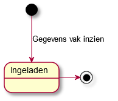

# Damian

___________________________________________________________________________

## Use case

# 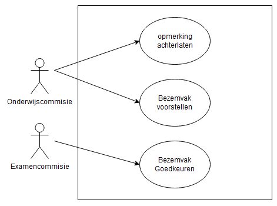

## Use case templates

<table>
  <tr>
    <td>UC-03</td>
    <td>Beschrijving</td>
  </tr>
  <tr>
    <td>Naam</td>
    <td>Opmerking plaatsen</td>
  </tr>
  <tr>
    <td>Beschrijving</td>
    <td>Actor kan een opmerking plaatsen onder een bezemvak</td>
  </tr>
  <tr>
    <td>Actors</td>
    <td>Onderwijscoördinator</td>
  </tr>
  <tr>
    <td>Preconditie</td>
    <td>Actor moet ingelogd zijn</td>
  </tr>
  <tr>
    <td>Scenario</td>
    <td>Het systeem start op
      Actor gaat naar de vakkenlijst
       
      Actor klikt op een vak
       
      Actor schrijft een opmerking
       
      Actor klikt op verzenden
       
      Systeem sluit af
    </td>
  </tr>
  <tr>
    <td>Postconditie</td>
    <td>Er komt een opmerking te staan onder die aan een vak is gekoppeld</td>
  </tr>
  <tr>
    <td>Alternatief Scenario</td>
    <td>UC-A-03

</td>
  </tr>
  <tr>
    <td>Trigger</td>
    <td>Actor wil zijn opmerking annuleren</td>
  </tr>
  <tr>
    <td>Scenario</td>
    <td>Het systeem start op
       
      Actor gaat naar de vakkenlijst
       
      Actor klikt op een vak
       
      Actor schrijft een opmerking
       
      Actor klikt op annuleren
       
      Systeem sluit af
    </td>
  </tr>
  <tr>
    <td>A-Postconditie</td>
    <td>n.v.t</td>
  </tr>
  <tr>
    <td>Exception scenario</td>
    <td>UC-E-03</td>
  </tr>
  <tr>
    <td>Trigger</td>
    <td>Actor heeft een ongeldige invoer gegeven</td>
  </tr>
  <tr>
    <td>Scenario</td>
    <td>Het systeem start op
       
      Actor gaat naar de vakkenlijst
       
      Actor klikt op een vak
       
      Actor schrijft een opmerking
       
      er komt een foutmelding die aangeeft dat er niets is ingevuld / te veel is ingevuld
       
      Systeem sluit af
    </td>
  </tr>
  <tr>
    <td>E-Postconditie</td>
    <td>n.v.t
</td>
  </tr>
</table>

<table>
  <tr>
    <td>UC-04</td>
    <td>Beschrijving</td>
  </tr>
  <tr>
    <td>Naam</td>
    <td>Bezemvak voorstellen</td>
  </tr>
  <tr>
    <td>Beschrijving</td>
    <td>Actor kan een Bezemvak voorstellen</td>
  </tr>
  <tr>
    <td>Actors</td>
    <td>Onderwijscoördinator</td>
  </tr>
  <tr>
    <td>Preconditie</td>
    <td>Actor moet ingelogd zijn</td>
  </tr>
  <tr>
    <td>Scenario</td>
    <td>Het systeem start op
       
      Actor gaat naar bezemvak aanmaken en voorstellen
       
      Actor maakt een volledig bezemvak aan
       
      Actor stelt de bezemvak voor
       
      het systeem sluit af
    </td>
  </tr>
  <tr>
    <td>Postconditie</td>
    <td>Bezemvak is voorgesteld</td>
  </tr>
  <tr>
    <td>Alternatief Scenario</td>
    <td>UC-A-04

</td>
  </tr>
  <tr>
    <td>trigger</td>
    <td>Actor wil bezemvak tijdelijk opslaan</td>
  </tr>
  <tr>
    <td>scenario</td>
    <td>Het systeem start op
       
      Actor gaat naar bezemvak aanmaken en voorstellen
       
      Actor maakt niet volledige bezemvak aan
       
      Actor klikt op tijdelijk opslaan
       
      actor maakt de bezemvak af
       
      Actor stelt de bezemvak voor
       
      het systeem sluit af
    </td>
  </tr>
  <tr>
    <td>Exception scenario</td>
    <td>UC-E-04</td>
  </tr>
  <tr>
    <td>Trigger</td>
    <td>Actor heeft een ongeldige invoer gegeven</td>
  </tr>
  <tr>
    <td>Scenario</td>
    <td>Het systeem start op
       
      Actor gaat naar de vakkenlijst
       
      Actor klikt op een vak
       
      Actor schrijft een opmerking
       
      er komt een foutmelding die aangeeft dat er niets is ingevuld / te veel is ingevuld
       
      Systeem sluit af
    </td>
  </tr>
  <tr>
    <td>E-Postconditie</td>
    <td>n.v.t
</td>
  </tr>
</table>

<table>
  <tr>
    <td>UC-05</td>
    <td>Beschrijving</td>
  </tr>
  <tr>
    <td>Naam</td>
    <td>Bezemvak goedkeuren</td>
  </tr>
  <tr>
    <td>Beschrijving</td>
    <td>Actor kan een Bezemvak goedkeuren</td>
  </tr>
  <tr>
    <td>Actors</td>
    <td>Examencommisie</td>
  </tr>
  <tr>
    <td>Preconditie</td>
    <td>Actor moet ingelogd en de juiste rol hebben</td>
  </tr>
  <tr>
    <td>Scenario</td>
    <td>Het systeem start op
       
      Actor gaat naar de voorgestelde bezemvakken pagina
       
      Actor keurt bezemvak goed
       
      Het systeem sluit af
    </td>
  </tr>
  <tr>
    <td>Postconditie</td>
    <td>De bezemvak is toegevoegd aan de lijst met bezemvakken</td>
  </tr>
  <tr>
    <td>Alternatief Scenario</td>
    <td>UC-A-05

</td>
  </tr>
  <tr>
    <td>trigger</td>
    <td>Actor wil bezemvak weigeren</td>
  </tr>
  <tr>
    <td>scenario</td>
    <td>Het systeem start op
       
      Actor gaat naar de voorgestelde bezemvakken pagina
       
      Actor weigerd de bezemvak
       
      bezemvak
       
      Het systeem sluit af
    </td>
  </tr>
  <tr>
    <td>Postconditie</td>
    <td>n.v.t</td>
  </tr>
  <tr>
    <td>Exception scenario</td>
    <td>n.v.t</td>
  </tr>
</table>

## Toestandsdiagrammen

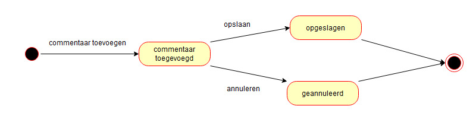

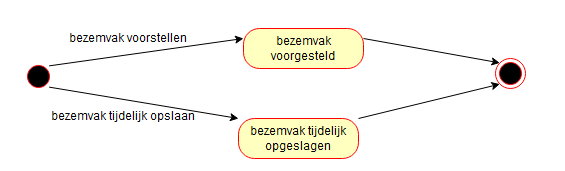

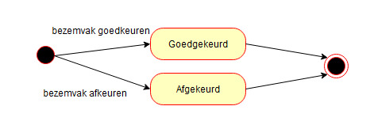

## Klassendiagram

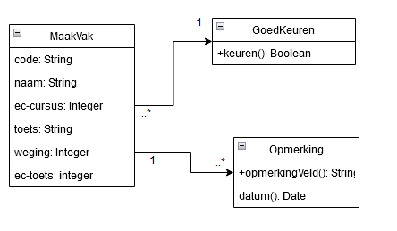

# Kevin

___________________________________________________________________________

## Use case

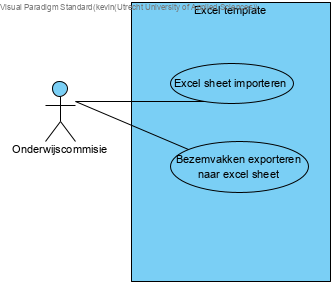

## Use case templates

<table>
  <tr>
    <td>UC-10</td>
    <td>Beschrijving</td>
  </tr>
  <tr>
    <td>Naam</td>
    <td>Excel sheet importeren </td>
  </tr>
  <tr>
    <td>Beschrijving</td>
    <td>Actor kan een excel sheet met bezemvakken importeren in het systeem</td>
  </tr>
  <tr>
    <td>Actors</td>
    <td>Onderwijscommissie</td>
  </tr>
  <tr>
    <td>Preconditie</td>
    <td>Actor moet ingelogd zijn</td>
  </tr>
  <tr>
    <td>Scenario</td>
    <td>Systeem start op
       
      Actor drukt op importeren knop
       
      Actor selecteert excel bestand
       
      Systeem sluit af
    </td>
  </tr>
  <tr>
    <td>Postconditie</td>
    <td>De bezemvakken zijn geïmporteerd en opgeslagen op het systeem</td>
  </tr>
  <tr>
    <td>Alternatief Scenario</td>
    <td>
n.v.t
</td>
  </tr>
  <tr>
    <td>Exception scenario</td>
    <td>UC-E-10
</td>
  </tr>
  <tr>
    <td>trigger</td>
    <td>Actor selecteer onjuist bestand</td>
  </tr>
  <tr>
    <td>scenario</td>
    <td>Het systeem start op
       
      Actor drukt op importeren knop
       
      Actor selecteert bestand
       
      Systeem toont foutmelding
       
      Systeem sluit af
    </td>
  </tr>
  <tr>
    <td>postconditie</td>
    <td>n.v.t</td>
  </tr>
</table>

<table>
  <tr>
    <td>UC-11</td>
    <td>Beschrijving</td>
  </tr>
  <tr>
    <td>Naam</td>
    <td>Bezemvakken exporteren naar excel sheet</td>
  </tr>
  <tr>
    <td>Beschrijving</td>
    <td>Actor kan alle bezemvakken exporten tot een excel sheet</td>
  </tr>
  <tr>
    <td>Actors</td>
    <td>Onderwijscommissie</td>
  </tr>
  <tr>
    <td>Preconditie</td>
    <td>Actor moet ingelogd zijn</td>
  </tr>
  <tr>
    <td>Scenario</td>
    <td>Systeem start op
       
      Actor drukt op exporteren knop
       
      Systeem sluit af
    </td>
  </tr>
  <tr>
    <td>Postconditie</td>
    <td>De actor heeft een excel sheet met bezemvakken</td>
  </tr>
  <tr>
    <td>Alternatief Scenario</td>
    <td>
n.v.t
</td>
  </tr>
  <tr>
    <td>Exception scenario</td>
    <td>n.v.t
</td>
  </tr>
</table>

## Toestandsdiagrammen

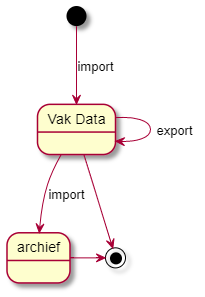

## Klassendiagram

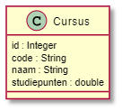

# Ewout

___________________________________________________________________________

## Use case

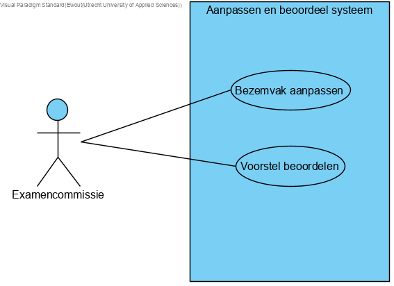

## Use case templates

<table>
  <tr>
    <td>UC-05</td>
    <td>Beschrijving</td>
  </tr>
  <tr>
    <td>Naam</td>
    <td>Bezemvak aanpassen</td>
  </tr>
  <tr>
    <td>Beschrijving</td>
    <td>Actor kan een Bezemvak aanpassen</td>
  </tr>
  <tr>
    <td>Actors</td>
    <td>Examencommissie</td>
  </tr>
  <tr>
    <td>Preconditie</td>
    <td>Actor moet ingelogd zijn</td>
  </tr>
  <tr>
    <td>Scenario</td>
    <td>Het systeem start op.
      Actor gaat naar bezemvakken overzicht scherm.
       
      Actor maakt een kiest bij het aan te passen bezemvak "aanpassen".
       
      Actor gaat naar bezemvak aanpassen scherm.
       
      Actor past het bezemvak aan.
       
      Actor selecteert “submit”.
       
      het systeem sluit af
    </td>
  </tr>
  <tr>
    <td>Postconditie</td>
    <td>Het bezemvak is aangepast.</td>
  </tr>
  <tr>
    <td>Alternatief Scenario</td>
    <td>n.v.t.</td>
  </tr>
  <tr>
    <td></td>
    <td></td>
  </tr>
  <tr>
    <td></td>
    <td></td>
  </tr>
  <tr>
    <td>Exception scenario</td>
    <td>UC-E-05</td>
  </tr>
  <tr>
    <td>Trigger</td>
    <td>Actor heeft niets aangepast</td>
  </tr>
  <tr>
    <td>Scenario</td>
    <td>Het systeem start op.
       
      Actor gaat naar bezemvak aanpassen scherm.
       
      Actor past niets aan.
       
      Actor klikt op “submit”.
       
      er komt een foutmelding die aangeeft dat er niets is veranderd
       
      Systeem sluit af
    </td>
  </tr>
  <tr>
    <td>E-Postconditie</td>
    <td>n.v.t
</td>
  </tr>
</table>

<table>
  <tr>
    <td>UC-06</td>
    <td>Beschrijving</td>
  </tr>
  <tr>
    <td>Naam</td>
    <td>Voorstel beoordelen</td>
  </tr>
  <tr>
    <td>Beschrijving</td>
    <td>Actor kan een voorstel beoordelen</td>
  </tr>
  <tr>
    <td>Actors</td>
    <td>Examencommissie</td>
  </tr>
  <tr>
    <td>Preconditie</td>
    <td>Actor moet ingelogd zijn</td>
  </tr>
  <tr>
    <td>Scenario</td>
    <td>Het systeem start op.
       
      Actor gaat naar het voorstel beoordelen scherm.
       
      Actor leest het voorstel door.
       
      Actor klikt op goedkeuren of afkeuren.
       
      het systeem sluit af
    </td>
  </tr>
  <tr>
    <td>Postconditie</td>
    <td>Het voorstel is beoordeeld</td>
  </tr>
  <tr>
    <td>Alternatief Scenario</td>
    <td>n.v.t.</td>
  </tr>
  <tr>
    <td></td>
    <td></td>
  </tr>
  <tr>
    <td></td>
    <td></td>
  </tr>
  <tr>
    <td>Exception scenario</td>
    <td>UC-E-06</td>
  </tr>
  <tr>
    <td>Trigger</td>
    <td>Er is geen voorstel om te beoordelen</td>
  </tr>
  <tr>
    <td>Scenario</td>
    <td>Het systeem start op.
       
      Actor gaat naar voorstel beoordelen scherm.
       
      Systeem heeft geen voorstellen.
       
      Systeem geeft een foutmelding die aangeeft dat alle voorstellen al beoordeeld zijn.
       
      Actor wordt teruggestuurd naar hoofdscherm.
       
      Systeem sluit af
    </td>
  </tr>
  <tr>
    <td>E-Postconditie</td>
    <td>n.v.t
</td>
  </tr>
</table>

## Toestandsdiagrammen

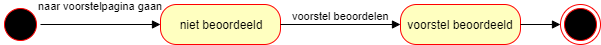

## Klassendiagram

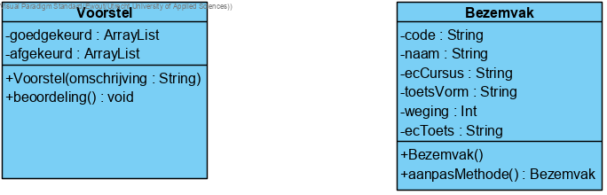
